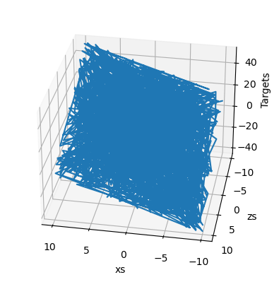
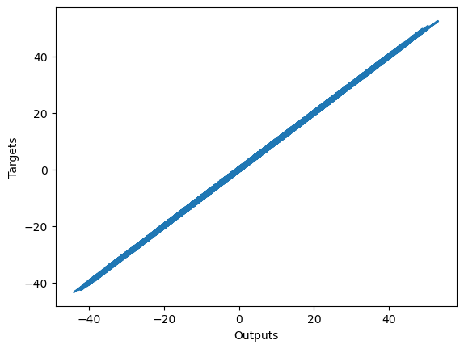
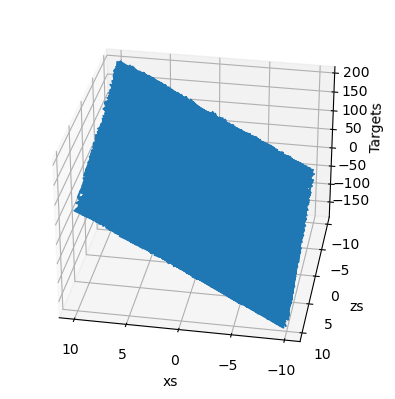
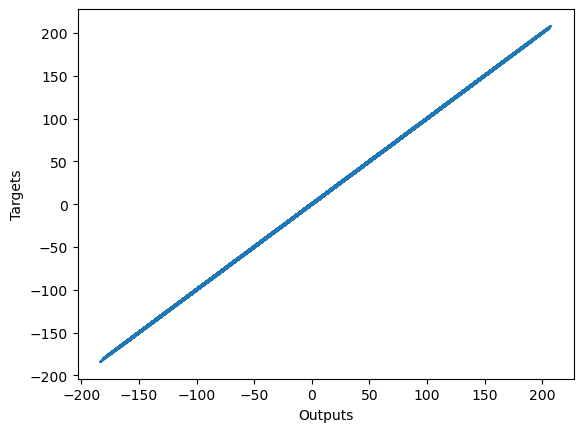

# Simple Linear Regression, Minimal Example

## Import the relevant libraries


```python
import numpy as np #math operation
import matplotlib.pyplot as plt # nice graph
from mpl_toolkits.mplot3d import Axes3D #3d graph
```

## Generate random input data to train on


```python
observations = 1000
#np.random.uniform(low,high,size) : draws a random value from the interval (low, high), where each number
#has an equal change to be selected

xs = np.random.uniform(low=-10,high=10,size=(observations,1))#appropriate size = number of observation x number of variable 
zs = np.random.uniform(-10,10,(observations,1))
#np.colum_stack(appropriate tuples) takes a sequence of 1D array and stacks them into single 2D array 
inputs = np.column_stack((xs,zs))

print(inputs.shape)
```

    (1000, 2)
    

## Create the target we will aim at


```python
# target : f(x,z) = 2*x - 3*z + 5 + noise
noise = np.random.uniform(-1,1,(observations,1))
targets = np.array(2*xs - 3*zs + 5 + noise)

print(targets.shape)

```

    (1000, 1)
    

## Plot the training data

The point is to see that is a strong trend that our model should learn to reproduce


```python
# In order to use the 3D plot, the objects should have a certain shape, so we reshape the targets.
# The proper method to use is reshape and takes as arguments the dimensions in which we want to fit the object.
targets = targets.reshape(observations,)
# Plotting according to the conventional matplotlib.pyplot syntax

# Declare the figure
fig = plt.figure()
# A method allowing us to create the 3D plot
ax = fig.add_subplot(111, projection='3d')
# Choose the axes.
xs = xs.reshape(observations,)
zs = zs.reshape(observations,)
# Set labels
ax.plot(xs, zs, targets)
ax.set_xlabel('xs')
ax.set_ylabel('zs')
ax.set_zlabel('Targets')
# You can fiddle with the azim parameter to plot the data from different angles. Just change the value of azim=100
# to azim = 0 ; azim = 200, or whatever. Check and see what happens.
ax.view_init(azim=100)
plt.show()
# We reshape the targets back to the shape that they were in before plotting.
# This reshaping is a side-effect of the 3D plot. Sorry for that.
targets = targets.reshape(observations,1)
xs = xs.reshape(observations,1)
zs = zs.reshape(observations,1)
```


    

    


## Initialize variable


```python
init_range = 0.1 

weights = np.random.uniform(-init_range,init_range,size=(2,1))
biases = np.random.uniform(-init_range,init_range,size=1)

print(weights)
print(biases)
```

    [[ 0.01170381]
     [-0.07317897]]
    [-0.03564069]
    

## Set Learning Rate


```python
learning_rate= 0.02
```

## Train the model

Game plan for each iteration :
- Calculate outputs
- Compare outputs to targets through the loss
- Print the loss
- Adjust weights and biases 


```python
for i in range(100): 
    outputs = np.dot(inputs,weights) + biases 
    deltas = outputs - targets
    
    loss = np.sum(deltas**2)/2/observations # loss/observations = mean (average) loss
   
    print (loss)
    
    deltas_scaled = deltas / observations 
    
    weights = weights - learning_rate * np.dot(inputs.T,deltas_scaled)
    biases = biases - learning_rate * np.sum(deltas_scaled)
    #Re-running the code will affect the output loss, more iteration - more close outputs to targets
```

    0.17197279421032666
    0.1719727942103267
    0.1719727942103267
    0.17197279421032668
    0.17197279421032668
    0.17197279421032666
    0.1719727942103267
    0.17197279421032668
    0.17197279421032668
    0.17197279421032663
    0.1719727942103266
    0.17197279421032668
    0.17197279421032668
    0.17197279421032663
    0.17197279421032668
    0.17197279421032668
    0.17197279421032666
    0.17197279421032668
    0.17197279421032663
    0.17197279421032674
    0.17197279421032663
    0.17197279421032663
    0.17197279421032668
    0.17197279421032668
    0.17197279421032663
    0.17197279421032674
    0.17197279421032668
    0.17197279421032663
    0.17197279421032663
    0.17197279421032663
    0.17197279421032668
    0.17197279421032663
    0.17197279421032663
    0.17197279421032668
    0.17197279421032663
    0.17197279421032663
    0.1719727942103266
    0.17197279421032657
    0.17197279421032657
    0.1719727942103267
    0.17197279421032666
    0.17197279421032666
    0.17197279421032668
    0.1719727942103266
    0.17197279421032663
    0.17197279421032663
    0.17197279421032668
    0.17197279421032666
    0.17197279421032663
    0.17197279421032663
    0.17197279421032663
    0.17197279421032663
    0.1719727942103266
    0.17197279421032657
    0.17197279421032663
    0.17197279421032663
    0.17197279421032668
    0.17197279421032668
    0.1719727942103266
    0.17197279421032666
    0.17197279421032663
    0.17197279421032663
    0.1719727942103266
    0.17197279421032663
    0.17197279421032663
    0.17197279421032663
    0.17197279421032663
    0.1719727942103266
    0.17197279421032663
    0.17197279421032657
    0.17197279421032668
    0.17197279421032668
    0.17197279421032663
    0.17197279421032663
    0.17197279421032666
    0.17197279421032668
    0.1719727942103266
    0.17197279421032652
    0.17197279421032668
    0.17197279421032663
    0.17197279421032663
    0.17197279421032663
    0.17197279421032666
    0.17197279421032657
    0.1719727942103266
    0.17197279421032663
    0.17197279421032668
    0.17197279421032668
    0.17197279421032666
    0.17197279421032663
    0.17197279421032666
    0.17197279421032663
    0.17197279421032663
    0.17197279421032663
    0.17197279421032663
    0.17197279421032663
    0.17197279421032663
    0.17197279421032666
    0.17197279421032663
    0.17197279421032663
    

## Print weights and biases and see if we have worked correctly


```python
print(weights,biases)
```

    [[ 1.99236389]
     [-3.00313919]] [4.98855904]
    

Try different : 
1. Number of observations
2. Learning Rate
3. Number of iterations
4. Initial range for initializing weights and biases


## Plot last output vs targets


```python
plt.plot(outputs,targets)
plt.xlabel('Outputs')
plt.ylabel('Targets')
plt.show()
```


    

    


# --------------------------------------------------------------------------------------------------------------

# Basic NN Example Exercises
Using the same code as before, please solve the following exercises:

    1. Change the number of observations to 100,000 and see what happens.

    2. Change the number of observations to 1,000,000 and see what happens.

    3. Play around with the learning rate. Values like:

    a) 0.0001 

    b) 0.001

    c) 0.1

    d) 1 

are all interesting to observe.

    4. Change the loss function. L2-norm loss (without dividing by 2) is a good way to start.

    5. Тry with the L1-norm loss, given by the sum of the ABSOLUTE value of yj - tj. You can check the exact formula in the respective notebook.

    6. Create a function f(x,z) = 13*xs + 7*zs - 12. Does the algorithm work in the same way?


```python
observations_1 = 10000
#np.random.uniform(low,high,size) : draws a random value from the interval (low, high), where each number
#has an equal change to be selected

xs_1 = np.random.uniform(low=-10,high=10,size=(observations_1,1))#appropriate size = number of observation x number of variable 
zs_1 = np.random.uniform(-10,10,(observations_1,1))
#np.colum_stack(appropriate tuples) takes a sequence of 1D array and stacks them into single 2D array 
inputs_1 = np.column_stack((xs_1,zs_1))

print(inputs.shape)
```

    (1000, 2)
    


```python
# target : f(x,z) = 2*x - 3*z + 5 + noise
noise_1 = np.random.uniform(-1,1,(observations_1,1))
targets_1 = np.array(13*xs_1 - 7*zs_1 + 12 + noise_1)

print(targets_1.shape)

```

    (10000, 1)
    


```python
# In order to use the 3D plot, the objects should have a certain shape, so we reshape the targets.
# The proper method to use is reshape and takes as arguments the dimensions in which we want to fit the object.
targets_1 = targets_1.reshape(observations_1,)
# Plotting according to the conventional matplotlib.pyplot syntax

# Declare the figure
fig = plt.figure()
# A method allowing us to create the 3D plot
ax = fig.add_subplot(111, projection='3d')
# Choose the axes.
xs_1 = xs_1.reshape(observations_1,)
zs_1 = zs_1.reshape(observations_1,)
# Set labels
ax.plot(xs_1, zs_1, targets_1)
ax.set_xlabel('xs')
ax.set_ylabel('zs')
ax.set_zlabel('Targets')
# You can fiddle with the azim parameter to plot the data from different angles. Just change the value of azim=100
# to azim = 0 ; azim = 200, or whatever. Check and see what happens.
ax.view_init(azim=100)
plt.show()
# We reshape the targets back to the shape that they were in before plotting.
# This reshaping is a side-effect of the 3D plot. Sorry for that.
targets_1 = targets_1.reshape(observations_1,1)
xs_1 = xs_1.reshape(observations_1,1)
zs_1 = zs_1.reshape(observations_1,1)
```


    

    


```python
init_range_1 = 0.01

weights_1 = np.random.uniform(-init_range_1,init_range_1,size=(2,1))
biases_1 = np.random.uniform(-init_range_1,init_range_1,size=1)

print(weights_1)
print(biases_1)
```

    [[ 0.00403278]
     [-0.00393845]]
    [0.00158005]
    


```python
learning_rate_1= 0.01
```


```python
for i in range(100): 
    outputs_1 = np.dot(inputs_1,weights_1) + biases_1 
    deltas_1 = outputs_1 - targets_1
    
    loss_1 = np.sum(deltas_1**2)/2/observations_1 # loss/observations = mean (average) loss
   
    print (loss_1)
    
    deltas_scaled_1 = deltas_1 / observations_1 
    
    weights_1 = weights_1 - learning_rate_1 * np.dot(inputs_1.T,deltas_scaled_1)
    biases_1 = biases_1 - learning_rate_1 * np.sum(deltas_scaled_1)
    #Re-running the code will affect the output loss, more iteration - more close outputs to targets
```

    0.1694696539176478
    0.16946965386970142
    0.16946965382270904
    0.16946965377665196
    0.16946965373151113
    0.1694696536872689
    0.16946965364390684
    0.16946965360140773
    0.1694696535597542
    0.16946965351892967
    0.16946965347891738
    0.16946965343970138
    0.16946965340126577
    0.16946965336359496
    0.16946965332667377
    0.16946965329048735
    0.1694696532550209
    0.16946965322026025
    0.1694696531861913
    0.16946965315280033
    0.16946965312007384
    0.1694696530879985
    0.1694696530565614
    0.16946965302574998
    0.16946965299555167
    0.1694696529659542
    0.16946965293694566
    0.16946965290851457
    0.16946965288064894
    0.16946965285333804
    0.1694696528265705
    0.16946965280033574
    0.16946965277462295
    0.1694696527494218
    0.16946965272472203
    0.16946965270051398
    0.1694696526767876
    0.16946965265353334
    0.1694696526307417
    0.16946965260840371
    0.16946965258651017
    0.16946965256505242
    0.16946965254402155
    0.16946965252340918
    0.169469652503207
    0.16946965248340676
    0.16946965246400067
    0.1694696524449806
    0.16946965242633916
    0.16946965240806852
    0.16946965239016157
    0.16946965237261083
    0.16946965235540948
    0.1694696523385503
    0.1694696523220267
    0.16946965230583183
    0.16946965228995925
    0.16946965227440247
    0.16946965225915533
    0.16946965224421162
    0.16946965222956523
    0.16946965221521026
    0.16946965220114096
    0.1694696521873517
    0.16946965217383667
    0.1694696521605908
    0.1694696521476084
    0.16946965213488427
    0.16946965212241338
    0.1694696521101907
    0.16946965209821124
    0.1694696520864701
    0.16946965207496265
    0.16946965206368417
    0.1694696520526301
    0.16946965204179595
    0.16946965203117761
    0.1694696520207704
    0.1694696520105703
    0.1694696520005732
    0.169469651990775
    0.16946965198117173
    0.16946965197175967
    0.16946965196253477
    0.1694696519534936
    0.16946965194463218
    0.16946965193594724
    0.16946965192743504
    0.16946965191909225
    0.16946965191091548
    0.16946965190290134
    0.16946965189504679
    0.16946965188734855
    0.1694696518798034
    0.1694696518724084
    0.16946965186516058
    0.16946965185805699
    0.16946965185109483
    0.1694696518442711
    0.16946965183758317
    


```python
print(weights_1,biases_1)
```

    [[13.00007095]
     [-6.9995927 ]] [11.99512061]
    


```python
plt.plot(outputs_1,targets_1)
plt.xlabel('Outputs')
plt.ylabel('Targets')
plt.show()
```


    

    


```python

```
